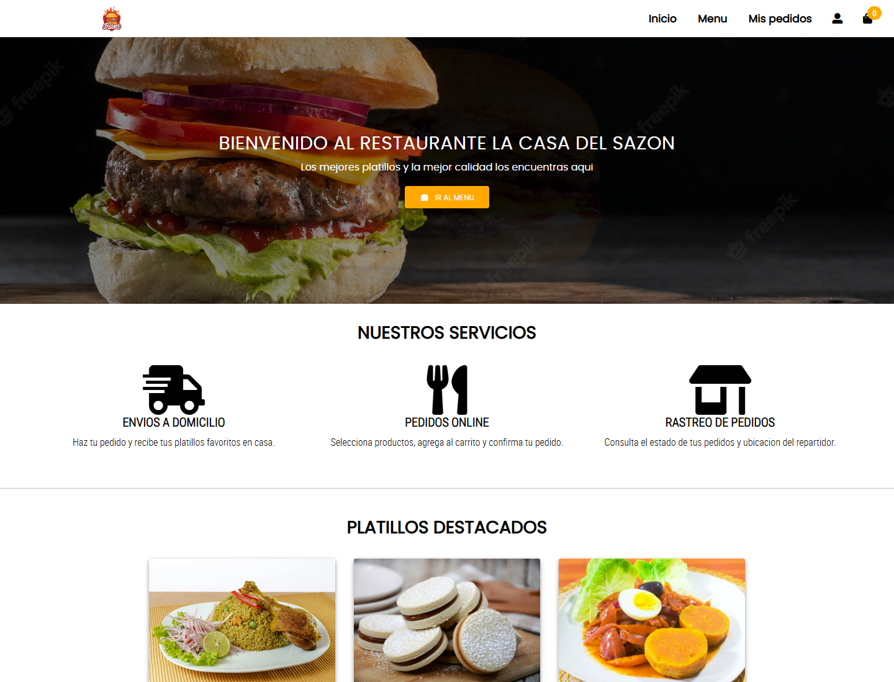

# La Casa del Sazon



Sistema web PHP para restaurante con catalogo de platillos, registro e inicio de sesion de clientes, carrito, pedidos, panel de administracion y rastreo de repartidores.

## Funcionalidades

- Inicio con platillos destacados.
- Menu con buscador.
- Registro e inicio de sesion de clientes.
- Carrito y confirmacion de pedidos.
- Panel de administracion de pedidos.
- Rastreo de repartidores con Leaflet y OpenStreetMap, sin API key.
- Simulador de ubicacion de repartidores.

## Stack

- PHP
- MySQL/MariaDB
- HTML, CSS y JavaScript
- Leaflet con OpenStreetMap para rastreo

## Requisitos

- PHP 8 o superior con extension `mysqli`.
- MySQL o MariaDB.
- Servidor local como XAMPP, Laragon, WAMP o el servidor integrado de PHP.

## Base de datos

Importa el archivo limpio de demo:

```sql
base-de-datos/restaurante_demo.sql
```

La base se llama `restaurante`. El archivo contiene datos de prueba, no datos reales de clientes.

## Configuracion

Por defecto el proyecto intenta conectarse asi:

```txt
DB_HOST=127.0.0.1
DB_USER=root
DB_PASSWORD=
DB_NAME=restaurante
```

Tambien puedes definir esas variables de entorno si tu instalacion usa otros datos.

## Ejecutar localmente

Con PHP instalado:

```powershell
php -S 127.0.0.1:3035 -t .
```

Luego abre:

```txt
http://127.0.0.1:3035/index.php
```

## Usuario de prueba

```txt
Correo: cliente@test.com
Clave: Cliente12345
```

## Rutas utiles

- Inicio: `/index.php`
- Menu: `/menu.php`
- Carrito: `/carrito.php`
- Mis pedidos y rastreo: `/mispedidos.php`
- Panel admin demo: `/admin_pedidos.php`
- Simulador de repartidores: `/test_ubicacion_repartidor.html`

## Calidad y seguridad

- La base incluida es una semilla de demostracion.
- No se requieren API keys para el mapa.
- El panel de administracion es una vista demo y no debe exponerse en produccion sin autenticacion de administrador.

## Enfoque de portafolio

El repositorio demuestra flujo completo de restaurante: catalogo, autenticacion, carrito, pedidos y rastreo. Para una version productiva se recomienda agregar autenticacion de administrador, roles, validaciones centralizadas y despliegue en un hosting con soporte PHP/MySQL.
